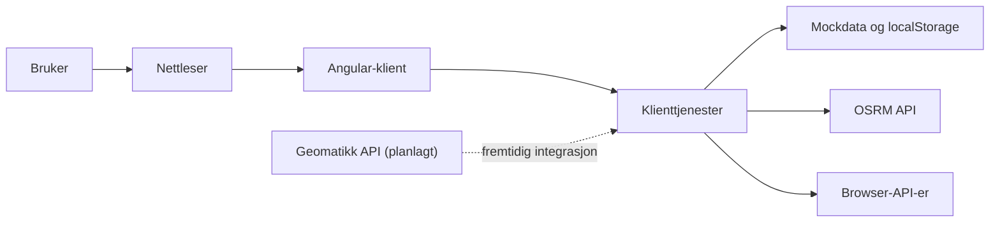
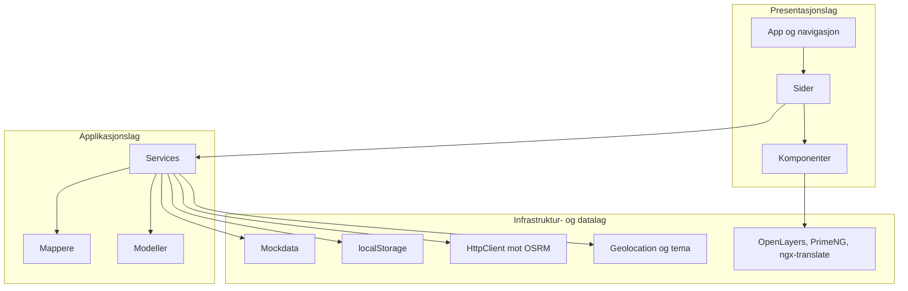
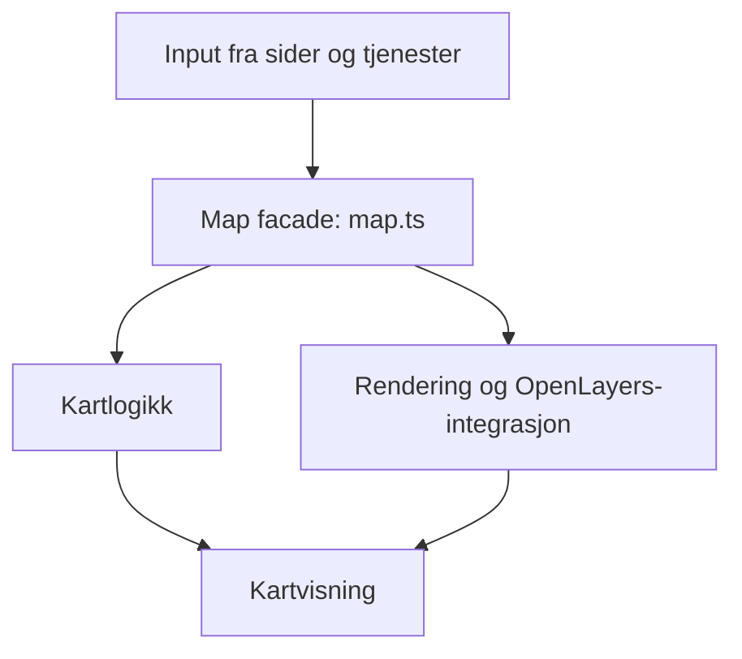
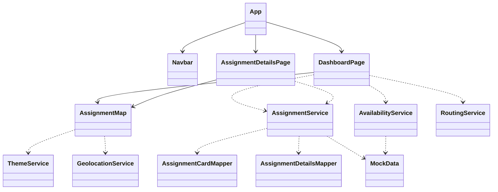

# MinArbeidsdag

MinArbeidsdag er en frontend-app utviklet som del av en bacheloroppgave. Løsningen er laget for å gi feltteknikere oversikt over oppdrag, reisetid, kartposisjoner og detaljer for dagens og morgendagens arbeid.

## 1. Introduksjon

Dette dokumentet er skrevet som teknisk dokumentasjon for bacheloroppgaven. Hensikten er å gi en kort og presis oversikt over hvordan løsningen er bygget opp, hvilke hovedkomponenter den består av, og hvordan den kan kjøres lokalt.

Dokumentet inneholder:

- overordnet arkitektur for løsningen
- prosjektstruktur og organisering av kildekoden
- et overordnet klassediagram for frontend-subsystemet
- kort omtale av lagring, eksterne tjenester og sikkerhet
- instruksjoner for installasjon, bygging og kjøring

Løsningen i dette repoet er et frontend-system. Den har ikke en egen produksjonsbackend eller database, men bruker mockdata, `localStorage`, nettleser-API-er og en ekstern rutetjeneste. Frontendet er samtidig utformet slik at det senere kan kobles til Geomatikk sitt API.

## 2. Arkitektur

### Figur 1: Overordnet systemarkitektur



Figuren viser løsningen slik den fungerer i dag. Brukeren benytter en Angular-klient i nettleseren, og klienten henter data gjennom interne tjenester. Disse tjenestene bruker mockdata og `localStorage` for oppdrag og tilgjengelighet, OSRM for ruteberegning og nettleser-API-er for blant annet geolokasjon og temaval.

### Figur 2: Lagdelt frontend-arkitektur



Frontendet er delt inn i lag for å gjøre løsningen enklere å forstå og videreutvikle. Presentasjonslaget består av sider og komponenter, applikasjonslaget håndterer logikk og mapping av data, og infrastrukturnivået håndterer lagring, eksterne kall og tredjepartsbiblioteker.

### Figur 3: Intern lagdeling i kartmodulen



Kartmodulen er den mest omfattende delkomponenten i løsningen. `map.ts` fungerer som en fasade som mottar input fra resten av systemet og fordeler ansvar til hjelpefiler for fokuslogikk, sporing, feature-bygging og rendering.

## 3. Prosjektstruktur

```text
.
├── public/
│   ├── assets/
│   │   ├── Geomatikk-logo.png
│   │   └── i18n/
├── src/
│   ├── main.ts
│   ├── styles.css
│   └── app/
│       ├── app.ts
│       ├── app.config.ts
│       ├── app.routes.ts
│       ├── core/
│       │   ├── data/
│       │   ├── layout/
│       │   ├── mappers/
│       │   ├── models/
│       │   └── services/
│       ├── features/
│       │   ├── assignment-details/
│       │   └── dashboard/
│       └── shared/
│           └── components/
│               └── map/
├── angular.json
├── package.json
└── tsconfig*.json
```

Prosjektet er organisert som et vanlig Angular-prosjekt med standalone-komponenter. `src/app/core` inneholder felles modeller, tjenester, mockdata og mappere, `features` inneholder brukerfunksjonalitet per side, og `shared` inneholder gjenbrukbare komponenter. `public/assets/i18n` inneholder språkfiler, mens `main.ts` er inngangspunktet for applikasjonen.

## 4. Klassediagram

Løsningen i dette repoet består bare av frontend-subsystemet, så det er dette subsystemet som er vist under.



Klassediagrammet viser hovedklassene i frontendet og de viktigste avhengighetene mellom dem. Sidene bruker tjenester for å hente og bearbeide data, kartkomponenten bruker egne tjenester for tema og posisjon, og tjenestene benytter mappere og mockdata for å levere modeller som passer til UI-et.

## 5. Databasemodell

Løsningen har ikke en egen database, og det finnes derfor ikke en tradisjonell databasemodell for prosjektet. Vedvarende data i prototypen lagres i stedet i nettleserens `localStorage`.

Viktig lokal lagring i løsningen:

- `assignment-details`: mockede oppdragsdata
- `availability-details`: mockede data for tilgjengelighet og fravær
- `assignment-personal-notes`: personlige notater per oppdrag
- `preferred-theme`: valgt lyst eller mørkt tema

Dette er kun ment for prototypebruk og bør ikke betraktes som en produksjonsklar datalagringsløsning.

## 6. Server-tjenester

Prosjektet inneholder ikke en egen REST-server eller WebSocket-server. Frontendet konsumerer likevel én ekstern HTTP-tjeneste:

| Tjeneste | Type | Bruk |
| --- | --- | --- |
| `https://router.project-osrm.org/route/v1/driving/{coordinates}` | GET | Henter rutesegmenter og beregnet reisetid mellom stopp i kartet |

I tillegg er løsningen ment for fremtidig integrasjon mot Geomatikk sitt API, men denne integrasjonen er ikke implementert i repoet per nå.

### Forventede datatyper fra Geomatikk API

Mockdataene og modellene i frontendet er basert på hvordan data forventes å komme fra Geomatikk API. I dagens prototype blir disse dataene forenklet og mappet videre til UI-modeller i `src/app/core/mappers`.

- `TechLocationDTO`: beskriver hvor feltteknikeren starter eller avslutter dagen. Objektet inneholder lokasjon, gyldighetsperiode og informasjon om adressen er fast eller midlertidig, for eksempel hotell eller hytte.
- `AvailabilityDTO`: beskriver fravær eller utilgjengelighet, for eksempel heldagsfravær, møte eller tannlegetime. DTO-en kan inneholde lokasjon, informasjon om fraværet gjelder hele dagen, og om fraværet krever at teknikeren drar hjem.
- `AssignmentDetailsDTO`: beskriver et oppdrag med status, tidspunkt, adresse, kontaktinformasjon, estimert oppdragstid, beregnet reisetid og hvilke entreprenører eller netteiere oppdraget gjelder for.

Det viktigste poenget for denne løsningen er at frontend-laget er bygget slik at mockdata senere kan erstattes med reelle data fra Geomatikk uten at presentasjonslaget må bygges om fra bunnen av.

## 7. Sikkerhet

Sikkerhet i denne prototypen er begrenset av at løsningen ikke har egen backend eller autentisering. Det viktigste for denne versjonen er derfor:

- løsningen har ikke innlogging, passordhåndtering eller access tokens
- kommunikasjon mot OSRM skjer over HTTPS
- det brukes ikke database, så klassiske SQL-injection-angrep er ikke relevante i dagens løsning
- Angulars vanlige databinding brukes i UI-et, og løsningen benytter ikke `innerHTML` for brukerinnhold
- personlige notater og mockdata lagres i `localStorage`, noe som ikke er egnet for sensitiv informasjon i produksjon
- geolokasjon håndteres gjennom nettleserens innebygde tillatelsesmodell

For en produksjonsversjon med ekte brukerdata bør autentisering, autorisasjon, sikker backend-lagring og tydelig tilgangskontroll legges til.

## 8. Installasjon og kjøring

### Viktige avhengigheter

| Avhengighet | Beskrivelse |
| --- | --- |
| Angular | Rammeverk for applikasjonen |
| RxJS | Håndtering av asynkrone datastrømmer |
| OpenLayers | Kartvisning og kartinteraksjon |
| PrimeNG | UI-komponenter |
| `@ngx-translate/core` | Språkstøtte |
| Vitest | Enhetstesting |

### Forutsetninger

- Node.js
- npm

### Installasjon

```bash
npm install
```

### Kjøring lokalt

```bash
npm start
```

Applikasjonen blir da tilgjengelig på `http://localhost:4200/`.

### Bygging

```bash
npm run build
```

### Testing

```bash
npm test
```

Det kreves ingen separat backend eller database for å kjøre denne prototypen lokalt.
