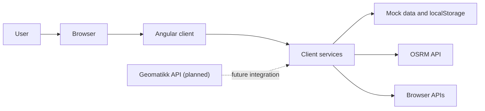
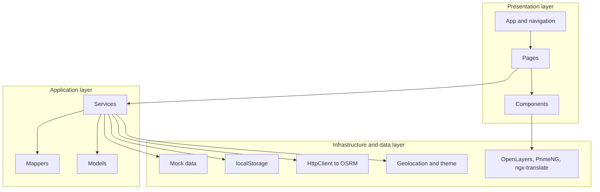
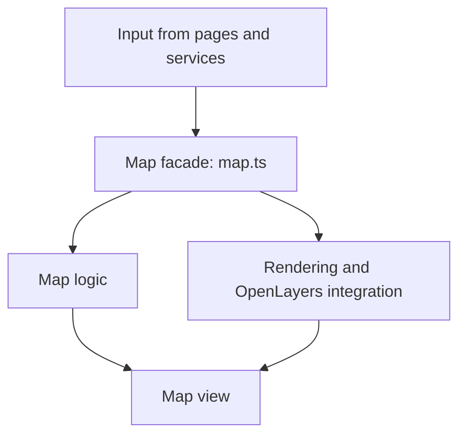
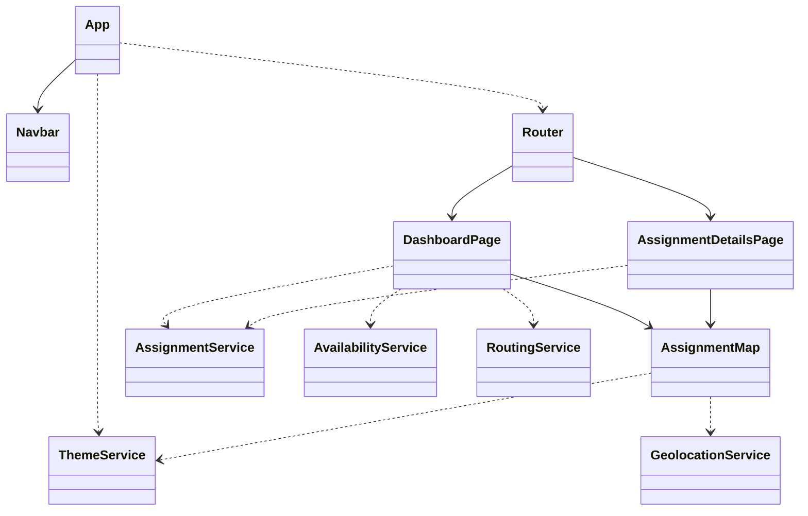

# MinArbeidsdag

MinArbeidsdag is a frontend application developed as part of a bachelor's thesis. The solution is designed to give field technicians an overview of assignments, travel time, map locations, and task details for the current and upcoming workday.

## 1. Introduction

This document serves as technical documentation for the bachelor's thesis. Its purpose is to provide a short and precise overview of how the solution is structured, which main components it consists of, and how it can be run locally.

This document includes:

- the overall architecture of the solution
- the project structure and organization of the source code
- a high-level class diagram for the frontend subsystem
- a brief description of storage, external services, and security
- instructions for installation, building, and running the application

The solution in this repository is a frontend system. It does not include a production backend or database, but instead uses mock data, `localStorage`, browser APIs, and an external routing service. At the same time, the frontend has been designed so that it can later be integrated with Geomatikk's API.

## 2. Architecture

### Figure 1: Overall System Architecture



The figure shows how the solution works today. The user interacts with an Angular client in the browser, and the client retrieves data through internal services. These services use mock data and `localStorage` for assignments and availability, OSRM for route calculation, and browser APIs for features such as geolocation and theme selection.

### Figure 2: Layered Frontend Architecture



The frontend is divided into layers to make the solution easier to understand and maintain. The presentation layer consists of pages and components, the application layer handles logic and data mapping, and the infrastructure layer handles storage, external calls, and third-party libraries.

### Figure 3: Internal Layering of the Map Module



The map module is the most extensive subcomponent in the solution. `map.ts` acts as a facade that receives input from the rest of the system and delegates responsibility to helper files for focus logic, tracking, feature building, and rendering.

## 3. Project Structure

```text
.
├── public/
│   └── assets/
│       └── i18n/
├── src/
│   ├── main.ts
│   └── app/
│       ├── core/
│       │   ├── data/
│       │   ├── layout/
│       │   ├── mappers/
│       │   ├── models/
│       │   └── services/
│       ├── features/
│       │   ├── assignment-details/
│       │   └── dashboard/
│       │       ├── components/
│       │       └── pages/
│       ├── app.config.ts
│       ├── app.routes.ts
│       └── shared/
│           └── components/
│               └── map/
├── angular.json
└── package.json
```

The project is organized as a standard Angular application using standalone components. `src/app/core` contains shared models, services, mock data, and mappers, while `features` contains user-facing functionality grouped by page. The dashboard feature also includes several reusable components within its own feature scope, such as cards, selectors, and bottom-sheet elements that are primarily used by the dashboard itself. `shared` contains reusable components intended to be used across features, such as the map module. `public/assets/i18n` contains translation files, while `main.ts` is the application's entry point.

## 4. Class Diagram

The solution in this repository only consists of a frontend subsystem, so the diagram below focuses on that subsystem.



The class diagram shows the main classes in the frontend and the most important dependencies between them. `App` initializes shared application concerns and routing, the pages use services to retrieve and process data, and the map component uses dedicated services for theme and position handling. Mapper functions and mock data modules are part of the implementation, but they are not shown here because they are not classes in the strict sense.

## 5. Database Model

The solution does not have its own database, and therefore there is no traditional database model for the project. Persistent data in the prototype is instead stored in the browser's `localStorage`.

Important local storage entries used in the solution:

- `assignment-details`: mocked assignment data
- `availability-details`: mocked availability and absence data
- `assignment-personal-notes`: personal notes per assignment
- `preferred-theme`: selected light or dark theme

This is intended for prototype use only and should not be considered a production-ready storage solution.

## 6. Server Services

The project does not include its own REST server or WebSocket server. However, the frontend does consume one external HTTP service:

| Service | Type | Purpose |
| --- | --- | --- |
| `https://router.project-osrm.org/route/v1/driving/{coordinates}` | GET | Retrieves route segments and estimated travel time between stops in the map view |

In addition, the solution is intended for future integration with Geomatikk's API, but that integration has not yet been implemented in this repository.

### Expected Data Types from the Geomatikk API

The mock data and frontend models are based on how data is expected to be delivered from the Geomatikk API. In the current prototype, this data is simplified and mapped into UI models in `src/app/core/mappers`.

- `TechLocationDTO`: describes where the field technician starts or ends the day. The object includes location, validity period, and whether the address is permanent or temporary, such as a hotel or cabin.
- `AvailabilityDTO`: describes absence or unavailability, such as full-day absence, a meeting, or a dentist appointment. The DTO may include location, whether the absence applies to the entire day, and whether the technician is expected to travel home for it.
- `AssignmentDetailsDTO`: describes an assignment with status, time, address, contact information, estimated time on site, calculated travel time, and which contractors or infrastructure owners the assignment concerns.

The most important point for this solution is that the frontend layer is structured so that mock data can later be replaced with real data from Geomatikk without rebuilding the presentation layer from scratch.

## 7. Security

Security in this prototype is limited by the fact that the solution does not include its own backend or authentication. The most relevant points for the current version are therefore:

- the solution does not include login, password handling, or access tokens
- communication with OSRM uses HTTPS
- there is no database, so classic SQL injection attacks are not relevant in the current solution
- Angular's standard data binding is used in the UI, and the solution does not use `innerHTML` for user content
- personal notes and mock data are stored in `localStorage`, which is not suitable for sensitive production data
- geolocation is handled through the browser's built-in permission model

For a production version using real user data, authentication, authorization, secure backend storage, and explicit access control would need to be added.

## 8. Installation and Running

### Main Dependencies

| Dependency | Description |
| --- | --- |
| Angular | Framework used to build the application |
| RxJS | Handles asynchronous data streams |
| OpenLayers | Provides map rendering and map interaction |
| PrimeNG | UI component library |
| `@ngx-translate/core` | Translation and language support |
| Vitest | Unit testing framework |

### Prerequisites

- Node.js
- npm

### Installation

```bash
npm install
```

### Run Locally

```bash
npm start
```

The application will then be available at `http://localhost:4200/`.

### Build

```bash
npm run build
```

### Testing

```bash
npm test
```

No separate backend or database is required to run this prototype locally.
